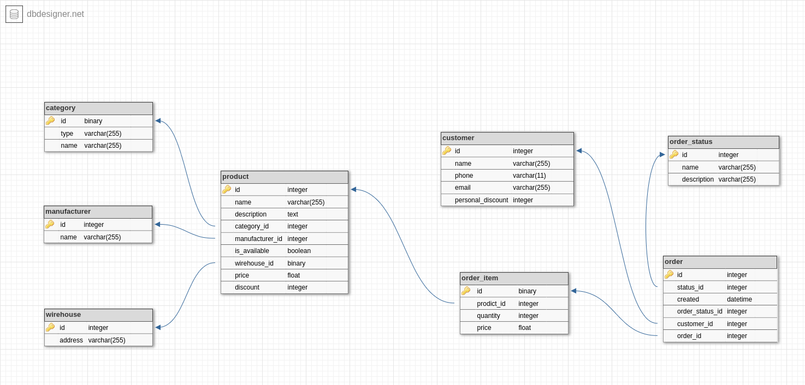

# База данных "Интернет-магазин"

## Описание базы данных

Приведен пример простейшей базы данных для Интернет-магазина, позволяющей отобразить товары на сайте Интернет-магазина, а также создавать заказ покупателем.

Предполагаются следующие таблицы и сущности:

- product - товар;
- category - категория (тип товара);
- manufactor - производитель товара;
- wirehouse - склад, где хранится товар;
- order - собранный заказ, отображающий его состав и статус;
- order_status - таблицы со статусами заказа;
- order_item - элемент заказа, включающий товар и его количество в заказе.
- customer - заказчик (покупатель) товара и его данные.

## Схема базы данных

## База данных позволяет решать следующие бизнес-задачи

- Отобразить на сайте Интернет-магазина каталог товаров с учётом статус товара.
- Создать заказ пользователем с отображением цены с учетом как скидок на товар, так и персональных скидок покупателя.
- Вести учет состояния заказа (интеграция с сервисом оплаты на схеме для простоты не приведена).
- Обновлять данные по товарам (тип товара, размещение на складе и т. п.).
